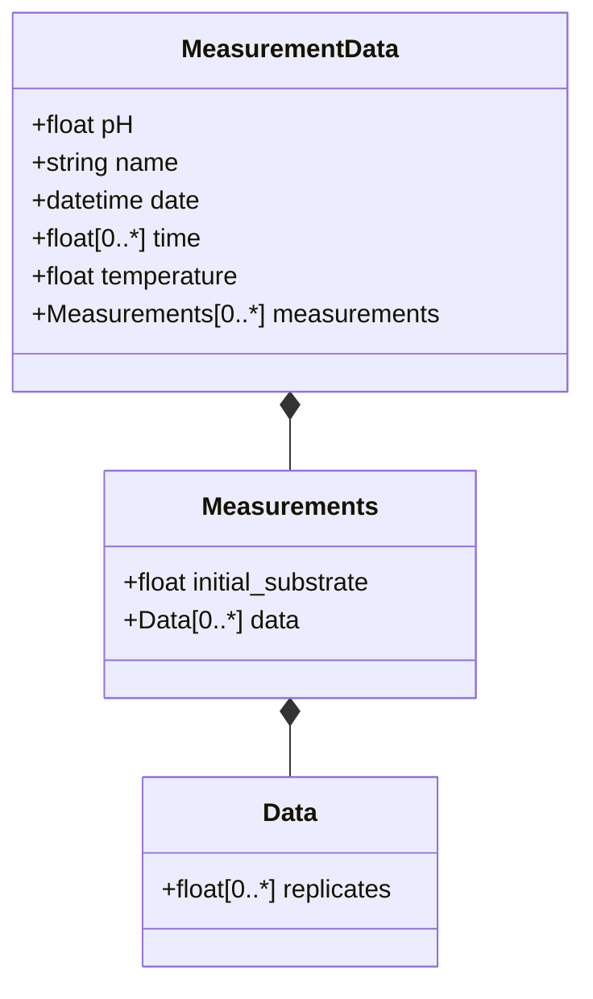

```mermaid
classDiagram
    MeasurementData *-- Measurements
    Measurements *-- Data
    
    class MeasurementData {
        +float pH
        +string name
        +datetime date
        +float[0..*] time
        +float temperature
        +Measurements[0..*] measurements
    }
    
    class Measurements {
        +float initial_substrate
        +Data[0..*] data
    }
    
    class Data {
        +float[0..*] replicates
    }
    
```